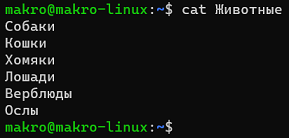
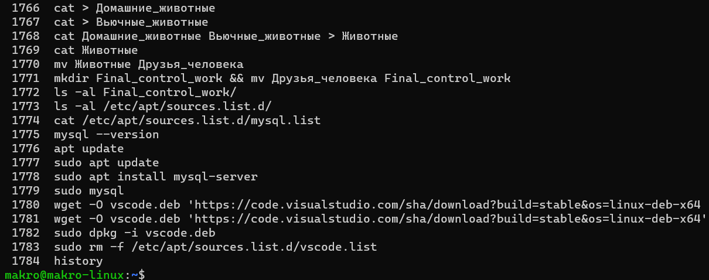
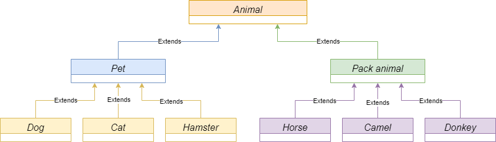

# Итоговая контрольная работа
(орфография и пунктуация автора заданий сохранены)

## Информация о проекте
### Необходимо организовать систему учета для питомника в котором живут домашние и вьючные животные

## Задание

### 1. Используя команду cat в терминале операционной системы Linux, создать два файла Домашние животные (заполнив файл собаками, кошками, хомяками) и Вьючные животными заполнив файл Лошадьми, верблюдами и ослы), а затем объединить их. Просмотреть содержимое созданного файла. Переименовать файл, дав ему новое имя (Друзья человека).
```shell
cat > Домашние_животные
```
Вводим данные
```
Собаки
Кошки
Хомяки
```
Сочетанием клавиш Ctrl+D закрываем ввод данных в файл
```shell
cat > Вьючные_животные
```
Вводим данные
```
Лошади
Верблюды
Ослы
```
Сочетанием клавиш Ctrl+D закрываем ввод данных в файл
```shell
cat Домашние_животные Вьючные_животные > Животные
```
```shell
cat Животные
```

```shell
mv Животные Друзья_человека
```

### 2. Создать директорию, переместить файл туда.
```shell
mkdir Final_control_work && mv Друзья_человека Final_control_work
```

### 3. Подключить дополнительный репозиторий MySQL. Установить любой пакет из этого репозитория.
```shell
sudo apt update
sudo apt install mysql-server
```

### 4. Установить и удалить deb-пакет с помощью dpkg.
```shell
wget -O vscode.deb 'https://code.visualstudio.com/sha/download?build=stable&os=linux-deb-x64'
sudo dpkg -i vscode.deb
sudo rm -f /etc/apt/sources.list.d/vscode.list
```

### 5. Выложить историю команд в терминале ubuntu
```shell
history
```


### 6. Нарисовать [диаграмму](diagram.drawio), в которой есть класс родительский класс, домашние животные и вьючные животные, в составы которых в случае домашних животных войдут классы: собаки, кошки, хомяки, а в класс вьючные животные войдут: Лошади, верблюды и ослы).


### 7. В подключенном MySQL репозитории создать базу данных “Друзья человека”
```shell
sudo mysql -u root -p
```
[Задания 7-12 сохранены в sql файле](mysql_tasks.sql)

### 13. Создать класс с Инкапсуляцией методов и наследованием по диаграмме.
